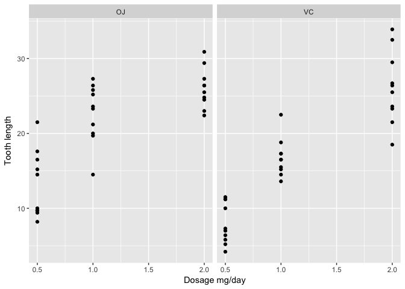

---
#### Install sql data frame to be able to use sql queries on the data frame (personal preference) on the console
install.packages("sqldf")


##Passenger Number of adults and children


```r
## Convert the table array to data frame
passenger <- as.data.frame(Titanic)

## Get the Number of adults
ans1 = sqldf("select Age, count(Age) [No. of] from passenger group by Age")
adults = ans1[1,2]
children = ans1[2,2]

cat ("No of adults:", adults)
```

```
## No of adults: 16
```

```r
cat ("No of adults:", children)
```

```
## No of adults: 16
```

#**How many children and adults were on Titanic?**


```r
## Get the Number of children

cat ("No of children:", children)
```

```
## No of children: 16
```

## Number of Female and male passenger


```r
## Get the number of females
fcount = sqldf("select count(Sex) from passenger where Sex = 'Female' and Age = 'Adult'")
females = fcount$`count(Sex)`

cat ("No of Female:", females)
```

```
## No of Female: 8
```


```r
## Get the number of males
mcount = sqldf("select count(Sex) from passenger where Sex = 'Male' and Age = 'Adult'")
males = fcount$`count(Sex)`

cat ("No of Male:", males)
```

```
## No of Male: 8
```

#**Were there more female adult or male adult passengers?**


```r
## Output the difference using 
if (males > females){cat("more males")} else if (males < females){cat("More females")} else {cat("No difference between the number of female and male passenger ")}
```

```
## No difference between the number of female and male passenger
```

##Number of children who survived


```r
## Number of children who survived
child_survived = (sqldf("select count(Age) as num from passenger where Age = 'Child' and survived = 'Yes'"))$num

cat ("No of children who survived:", child_survived)
```

```
## No of children who survived: 8
```


```r
## Child Survival rate = num of survivors / total children
childsurvrate = child_survived/children
cat ("Child survival rate is", childsurvrate * 100, "%")
```

```
## Child survival rate is 50 %
```

##Number of adults who survived


```r
## Number of adults who survived
adult_survived = (sqldf("select count(Age) as num from passenger where Age = 'Adult' and survived = 'Yes'"))$num

cat ("No of children who survived:", child_survived)
```

```
## No of children who survived: 8
```


```r
## Adult Survival rate = num of survivors / total adults
adultsurvrate = adult_survived/adults

cat ("Adult survival rate is", adultsurvrate * 100, "%")
```

```
## Adult survival rate is 50 %
```

#**Did the children have a better survival rate than the adults?**


```r
if (childsurvrate > adultsurvrate){cat("children had lower survival rate")} else if (childsurvrate < adultsurvrate){cat("children had lower survival rate")} else {cat("No diference in survival rate between children and adult")}
```

```
## No diference in survival rate between children and adult
```


```r
## Get the number of passengers in first, second and third class
first <- (sqldf("select count(Age) as num from passenger where Class = '1st'"))$num 
second <- (sqldf("select count(Age) as num from passenger where Class = '2nd'"))$num 
third <- (sqldf("select count(Age) as num from passenger where Class = '3rd'"))$num 
Crew <- (sqldf("select count(Age) as num from passenger where Class = 'Crew'"))$num 

## Get the number of passengers who survived in each class
firstsurvived = (sqldf("select count(Age) as num from passenger where Class = '1st' and survived = 'Yes'"))$num
secondsurvived =(sqldf("select count(Age) as num from passenger where Class = '2nd' and survived = 'Yes'"))$num
thirdsurvived = (sqldf("select count(Age) as num from passenger where Class = '3rd' and survived = 'Yes'"))$num
crewsurvived = (sqldf("select count(Age) as num from passenger where Class = 'Crew' and survived = 'Yes'"))$num
```

#Survival number by class.


```r
survivalVector = c(firstsurvived = firstsurvived, 
                   secondsurvived = secondsurvived,
                   thirdsurvived = thirdsurvived,
                   crewsurvived = crewsurvived)


maximumSurvival = max(survivalVector)

survivalVector[survivalVector==maximumSurvival]
```

```
##  firstsurvived secondsurvived  thirdsurvived   crewsurvived 
##              4              4              4              4
```

```r
# isAllEqual = function(vector){
#   comparisonVector = combn((vector),2)
#   all(apply(comparisonVector,2,function(x){
#   x[1] == x[2]
# }))
# }
# 
# isAllEqual(survivalVector)
```

#**Which class (Crew, first class, second class, third class) of passengers have a better survival rate?**


```r
cat ("All the classes had the same survival rate")
```

```
## All the classes had the same survival rate
```


#**The efffect of natural vs suplimentary Vitamin C on tooth growth in guinea pigs**


```r
## read the data from the URL
url <- "https://raw.githubusercontent.com/STAT540-UBC/STAT540-UBC.github.io/master/homework/practice_assignment/guinea_pigs_tooth_growth.txt"
tbl <- read.table(url, sep = '\t', header = T)

## make the plot
t <- ggplot(tbl,aes(dose,len))+
  geom_point()+
  facet_grid(. ~ supp)+
  ylab("Tooth length") +
  xlab("Dosage mg/day")
print (t)
```

<!-- -->

This graph shows the effects of Vitamin C concentration on tooth length in Guinea Pigs. The Vitamin C is administered via two methods, one from Orange juice(OJ) and Vitamin C (VC). This graph is informative because it shows the effects of the different dossages (0.5, 1, 2) of the Vitamin C againts the length of the tooth. This representation clearly separates between the two different sources of Vitamin C side by side for easy data distribuition inferences.

The data indicates that in the 0.5mg/day of vitamin C delivered to the Guinea Pig, the tooth length is longer for the Guinea Pigs that have been acquring the vitamin C from Orange Juice compared to the vitamin C
