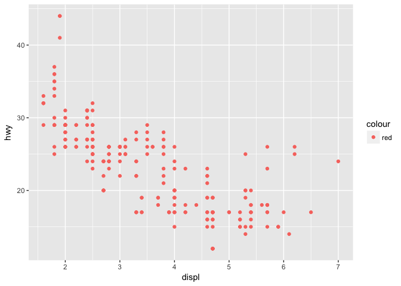
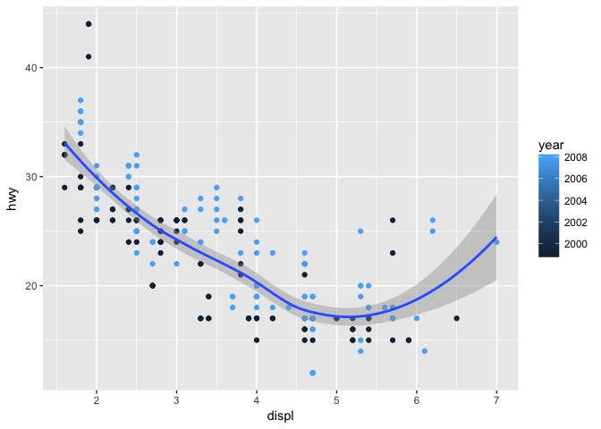
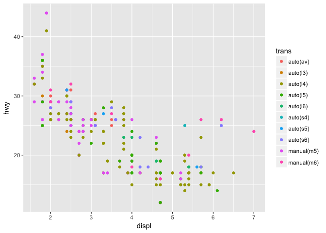
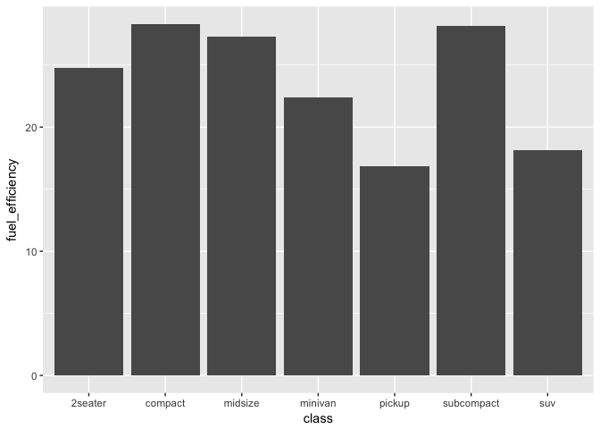
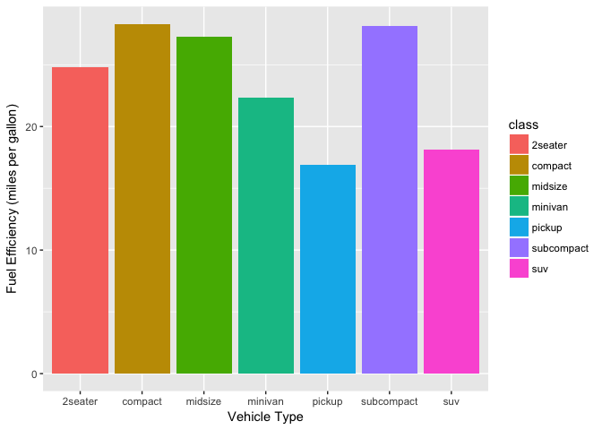
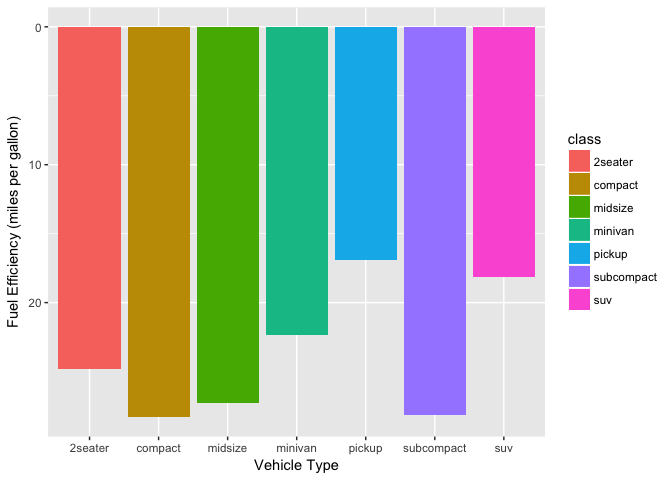
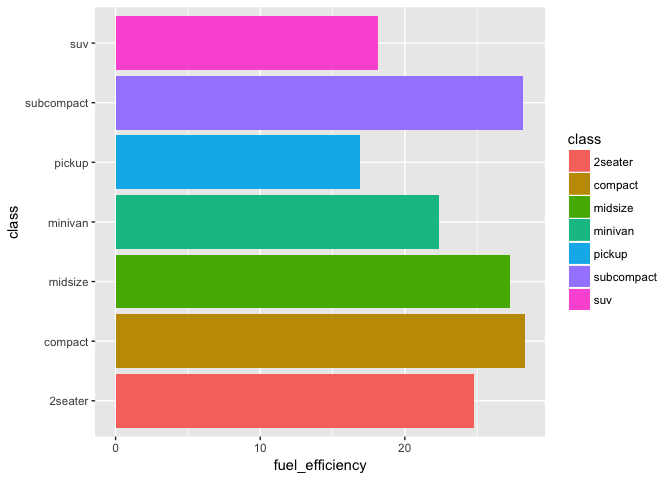
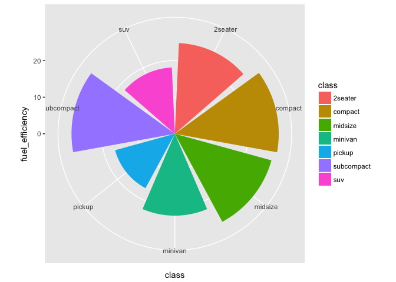
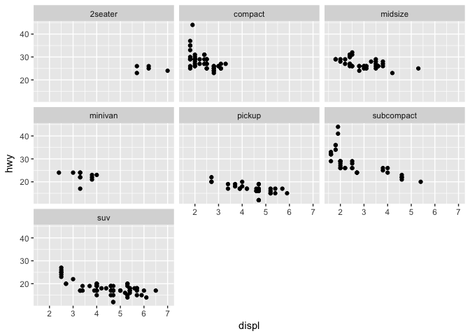
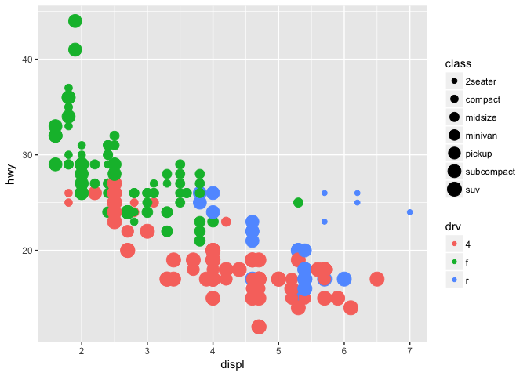

# Pre-deliverables exercise data for 2b 

Sample data set from 1999 till 2008 for 38 popular model cars from [EPA](http://fueleconomy.gov)


```r
ggplot2::mpg
```

```
## # A tibble: 234 x 11
##    manufac~ model   displ  year   cyl trans  drv     cty   hwy fl    class
##    <chr>    <chr>   <dbl> <int> <int> <chr>  <chr> <int> <int> <chr> <chr>
##  1 audi     a4       1.80  1999     4 auto(~ f        18    29 p     comp~
##  2 audi     a4       1.80  1999     4 manua~ f        21    29 p     comp~
##  3 audi     a4       2.00  2008     4 manua~ f        20    31 p     comp~
##  4 audi     a4       2.00  2008     4 auto(~ f        21    30 p     comp~
##  5 audi     a4       2.80  1999     6 auto(~ f        16    26 p     comp~
##  6 audi     a4       2.80  1999     6 manua~ f        18    26 p     comp~
##  7 audi     a4       3.10  2008     6 auto(~ f        18    27 p     comp~
##  8 audi     a4 qua~  1.80  1999     4 manua~ 4        18    26 p     comp~
##  9 audi     a4 qua~  1.80  1999     4 auto(~ 4        16    25 p     comp~
## 10 audi     a4 qua~  2.00  2008     4 manua~ 4        20    28 p     comp~
## # ... with 224 more rows
```

## Practice Scatterplot


```r
ggplot(data = mpg) + 
  geom_point(mapping = aes(x = displ, y = hwy))
```

<!-- -->

## Practice Scatterplot with colour visualization


```r
ggplot(data = mpg) + 
  geom_point(mapping = aes(x = displ, y = hwy, color = class ))
```

<!-- -->

## Practice Scatterplot size visualization


```r
ggplot(data = mpg) + 
  geom_point(mapping = aes(x = displ, y = hwy, size = class ))
```

<!-- -->

## Practice Scatterplot with fixed colour


```r
ggplot(data = mpg) + 
  geom_point(mapping = aes(x = displ, y = hwy, color = "red"))
```

<!-- -->

# ScatterPlot template

>ggplot(data = <DATA>) + 
  <GEOM_FUNCTION>(
     mapping = aes(<MAPPINGS>),
     stat = <STAT>, 
     position = <POSITION>
  ) +
  <COORDINATE_FUNCTION> +
  <SCALE_FUNCTION> +
  <AXIS_FUNCTION> +
  <FACET_FUNCTION>
  
## Practice Scatterplot regression with loess
 

```r
  ggplot(data = mpg,mapping = aes(x = displ, y = hwy)) +
  geom_point() +
  geom_smooth()
```

```
## `geom_smooth()` using method = 'loess'
```

<!-- -->

## Practice Scatterplot regression with loess and year visualization
 

```r
  ggplot(data = mpg,mapping = aes(x = displ, y = hwy, color = year)) +
  geom_point() +
  geom_smooth()
```

```
## `geom_smooth()` using method = 'loess'
```

<!-- -->

## Practice Scatterplot regression with transmission visualization


```r
  ggplot(data = mpg,mapping = aes(x = displ, y = hwy, color = trans)) +
  geom_point()
```

<!-- -->

## Variable assignation to fuel efficency using the piping command


```r
(averageEfficiency <- 
  mpg %>% group_by(class) %>% summarise(fuel_efficiency = mean(hwy)))
```

```
## # A tibble: 7 x 2
##   class      fuel_efficiency
##   <chr>                <dbl>
## 1 2seater               24.8
## 2 compact               28.3
## 3 midsize               27.3
## 4 minivan               22.4
## 5 pickup                16.9
## 6 subcompact            28.1
## 7 suv                   18.1
```

## Practice barchart fuel efficiecies of various clases


```r
ggplot(data = averageEfficiency) +
  geom_bar(aes(x = class, y = fuel_efficiency),
           stat = "identity")
```

<!-- -->

## Practice barchart fuel efficiencies of various clases with colour


```r
ggplot(data = averageEfficiency) +
  geom_bar(aes(x = class, y = fuel_efficiency, fill = class),
           stat = "identity")
```

<!-- -->

## Practice barchart fuel efficiencies of various clases with colour with properly labbeled axis


```r
ggplot(averageEfficiency) + 
  geom_bar(aes(x = class, y = fuel_efficiency, fill = class),
           stat = "identity") +
  ylab("Fuel Efficiency (miles per gallon)") +
  xlab("Vehicle Type")
```

<!-- -->

## Practice barchart fuel efficiencies of various clases (colour) inverted


```r
ggplot(averageEfficiency) + 
  geom_bar(aes(x = class, y = fuel_efficiency, fill = class),
           stat = "identity") +
  ylab("Fuel Efficiency (miles per gallon)") +
  xlab("Vehicle Type") +
  scale_y_reverse()
```

<!-- -->

## Practice barchart fuel efficiencies of various clases (colour) side fliped


```r
ggplot(averageEfficiency) + 
  geom_bar(aes(x = class, y = fuel_efficiency, fill = class),
           stat = "identity") +
  coord_flip()
```

<!-- -->

## Coord polar fuel efficiencies of various clases (colour)


```r
ggplot(averageEfficiency) + 
  geom_bar(aes(x = class, y = fuel_efficiency, fill = class),
           stat = "identity") +
  coord_polar()
```

<!-- -->

## Scatterplot fuel efficiencies of various clases in facet wrap


```r
ggplot(data = mpg, 
       mapping = aes(x = displ, y = hwy)) +
  geom_point() +
  facet_wrap(~class)
```

<!-- -->

#Deliverables for seminar 2b


```r
ggplot(data = mpg) + 
  geom_point(mapping = aes(x = displ, y = hwy, color = drv, size = class))
```

<!-- -->
  
                                                        
                                                        **The End** 
  
